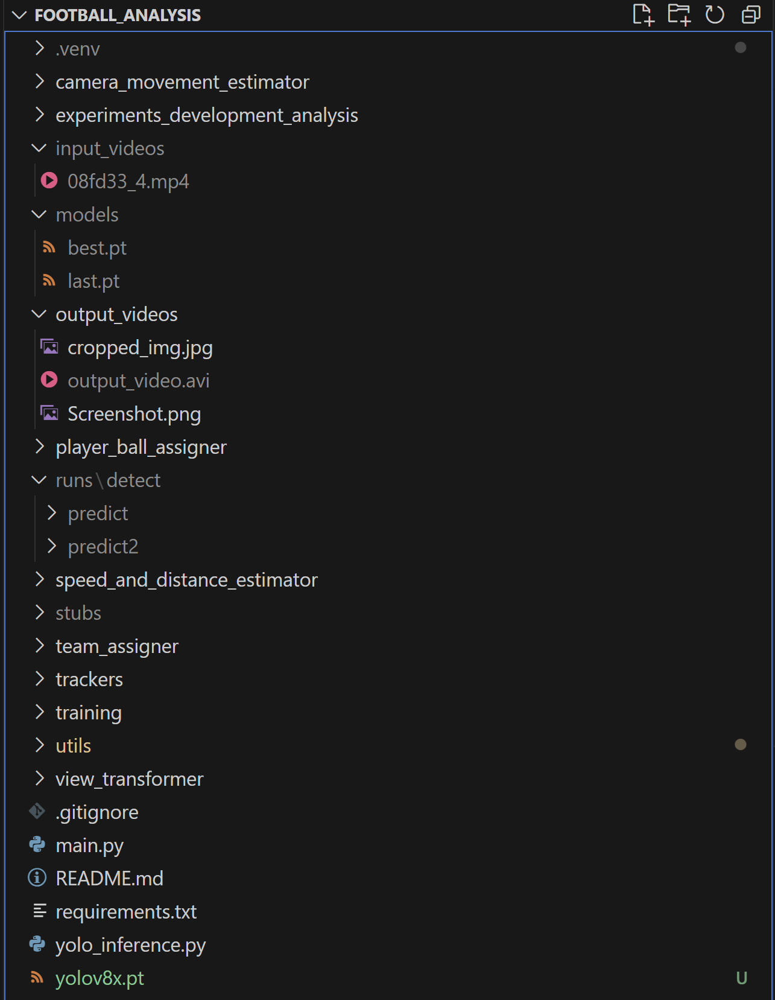

# Football Video Analysis

## Introduction

The objective of this project is to utilize YOLO, a top-tier AI object detection model, to identify and monitor players, referees, and footballs in a video. Enhancing the model's performance through training is also part of the agenda. Additionally, we aim to utilize Kmeans for pixel segmentation and clustering to categorize players into teams based on their t-shirt colors. This categorization allows us to compute a team's ball possession percentage during a match. Optical flow will be employed to gauge the movement of the camera between frames, facilitating precise measurement of player motion. Moreover, perspective transformation will be implemented to convey depth and perspective within the scene, enabling measurements of player movement in meters rather than pixels. Ultimately, calculations will be made to determine player speed and the distance traveled. This comprehensive project encompasses a range of concepts and tackles real-world challenges, rendering it suitable for all ML practitioners.

## Datasets
- kaggle Dataset: [https://www.kaggle.com/competitions/d...](https://www.kaggle.com/competitions/dfl-bundesliga-data-shootout/data?select=clips)
- Video link used because Kaggle removed the videos from the kaggle dataset above: https://drive.google.com/file/d/1t6agoqggZKx6thamUuPAIdN_1zR9v9S_/view
- Robowflow Football Dataset:  [https://universe.roboflow.com/roboflo...](https://universe.roboflow.com/roboflow-jvuqo/football-players-detection-3zvbc/dataset/1)

## Components
- YOLO: AI object detection model
- Kmeans: Pixel segmentation and clustering to detect t-shirt color
- Optical Flow: Measure camera movement
- Perspective Transformation: Represent scene depth and perspective
- Speed and distance calculation per player

## Requirements
- Python 3.x
- ultralytics
- supervision
- OpenCV
- NumPy
- Matplotlib
- Pandas

## Learnings
1. Utilize the ultralytics framework in conjunction with YOLOv8 to effectively detect objects within both images and video sequences. This involves leveraging cutting-edge object detection capabilities to accurately identify various elements present in visual data. Also used Supervision's ByteTracker to actively track different objects throughout the duration of the video across different frames. This later helps in our speed and distance calculation.
2. Engage in the process of fine-tuning and training our very own YOLO model tailored to our specific requirements and preferences. By utilizing our own custom dataset, we can enhance the model's performance and adapt it to address unique object recognition tasks.
3. Employ the KMeans algorithm to conduct pixel clustering, thereby facilitating the segmentation of players from the background. This method enables precise extraction of key visual elements, particularly focusing on discerning the t-shirt colors worn by players.
4. Implement OpticalFlow techniques to quantify and analyze the movement of the camera throughout the video footage. By tracking the displacement of pixels between consecutive frames, we gain valuable insights into the dynamics of camera motion.
5. Leverage the perspective transformation capabilities offered by CV2's (OpenCV) functionality. Through this process, we can effectively represent the spatial depth and perspective inherent within the scene, providing a more accurate depiction of the visual environment.
6. Utilize advanced techniques to measure the speed and distance covered by players captured within the image or video. By analyzing the trajectories and displacements of individual players, we can ascertain valuable metrics pertaining to their motion and activity within the scene.

## Directory Structure of the project for reference

